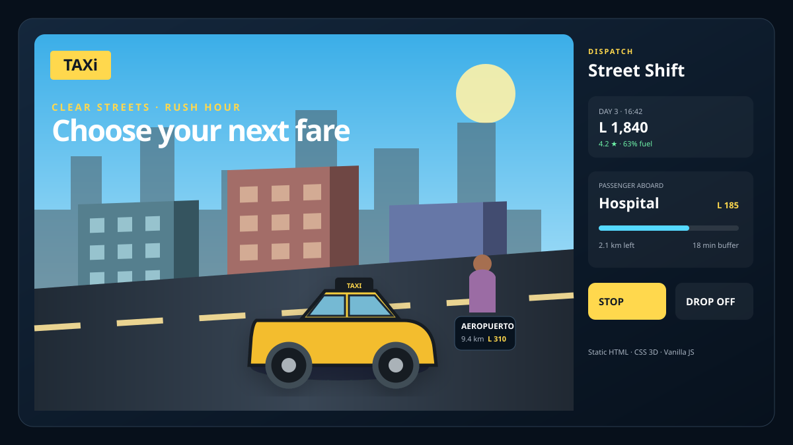
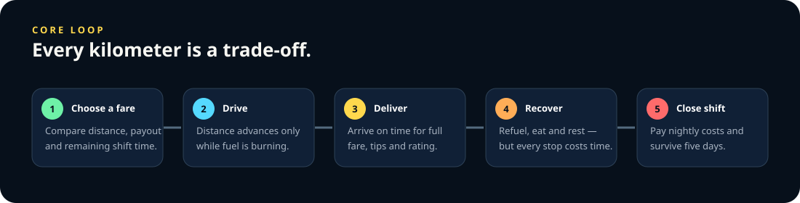
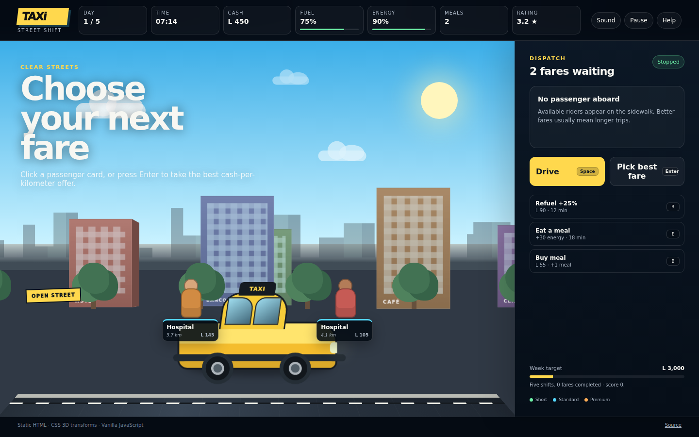
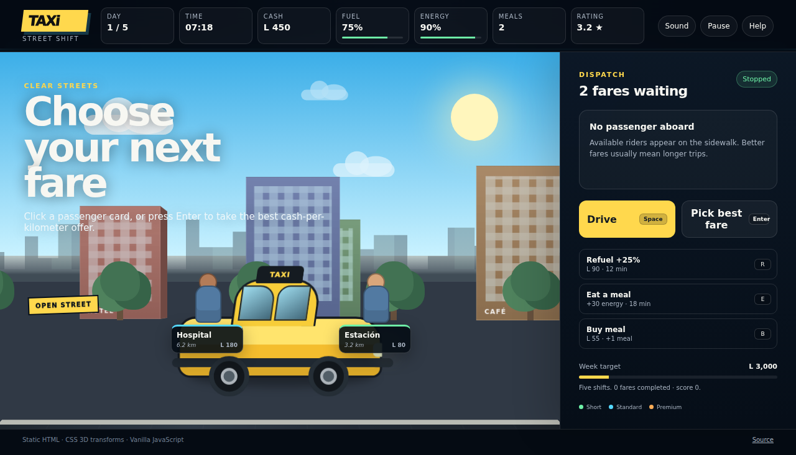

# TAXi — Street Shift

[](https://xtreemze.github.io/TAXi/)
[](LICENSE)



**TAXi** is a compact street-shift survival and resource-management game. Pick fares, decide when empty driving is worth the fuel, protect your passenger rating, and keep enough cash, food, energy and fuel to survive a five-day working week.

It is intentionally small and web-native: the entire playable build is static HTML, CSS and vanilla JavaScript. The city uses CSS perspective and 3D transforms rather than a canvas or game engine, and the sound cues are synthesized with the Web Audio API. There is no runtime package installation, build step, framework, CDN, analytics service or backend.

## Play

**Live game:** https://xtreemze.github.io/TAXi/

The repository root is the production build used by GitHub Pages. Clone it and open it through any static web server if you want to play locally:

```sh
python3 -m http.server 4173
```

Then open `http://localhost:4173`.

## Game design

The original TAXi prototype already had the right central idea: the taxi moves through a pseudo-3D roadside world, riders can be picked up and dropped off, time passes, fares earn cash, food matters, and roadside spending competes with income. Street Shift turns those isolated interactions into one legible game economy.



A fare is not automatically good. Longer rides usually pay more, but they consume more shift time, fuel and energy. Empty kilometers are pure operating cost. Rain raises fares but slows traffic; heat increases fatigue; rush hour reduces average speed. Late trips lose payout and rating. Better service increases the chance of tips and builds a streak bonus.

Each day ends at 19:00. Nightly operating costs are deducted and the driver must have food available to recover fully. The campaign lasts five shifts. The main target is to finish the week with at least **L 3,000** while keeping the taxi operational and the passenger rating above the suspension threshold.

### Systems

| System | Pressure it creates |
| --- | --- |
| Fare selection | Cash-per-kilometer vs. raw payout and deadline risk |
| Fuel | Penalizes wandering and repeated empty driving |
| Energy | Forces breaks; heat makes long continuous shifts costly |
| Meals | Turns recovery into an inventory and cash decision |
| Time | Services, traffic and waiting all consume the same finite shift |
| Rating | Rewards punctual trips and creates a failure condition for poor service |
| Weather | Changes the economics of each day instead of only changing visuals |
| Rush hour | Makes high-paying trips slower at predictable times |
| Nightly cost | Prevents revenue from being treated as profit |
| Streak / tips | Gives consistently good driving a compounding upside |

## Controls

The interface is fully usable with mouse/touch or keyboard.

| Action | Keyboard |
| --- | --- |
| Drive / stop | `Space` |
| Pick best available fare / drop off | `Enter` |
| Refuel | `R` |
| Eat a stored meal | `E` |
| Buy a meal | `B` |
| Mute / unmute | `M` |
| Pause / resume | `P` |
| Help | `H` |

On the street, individual passenger cards can be selected directly instead of using the automatic “best fare” action.

## Screenshots

The screenshots below are generated from the real static build in headless Chromium. The capture workflow starts a fresh shift at desktop and phone viewports and commits refreshed images whenever the game shell, styles or logic change on `master`.





The stable vector hero (`docs/preview.svg`) is kept separately for repository/social presentation so the project still has a deterministic visual even before the first automated capture runs.

## Technical approach

### Static by design

The production runtime is deliberately limited to three source files:

- `index.html` — semantic game shell, HUD, dispatch panel, modal surface and CSS-3D scene structure.
- `css/main.css` — responsive presentation, 3D building faces, perspective road, CSS taxi, passenger figures, weather states and reduced-motion behavior.
- `js/main.js` — deterministic game state, fare generation, resource economy, day/campaign state machine, persistence, input and procedural sound.

The legacy jQuery, GSAP, Howler, minified duplicates, tracked `node_modules`, sprite sources and prototype audio have been removed from the current tree. Git history remains the provenance record for the 2016 implementation, while the active repository contains only files relevant to the modern static game and its documentation/validation.

### CSS 3D instead of a renderer

Buildings are ordinary DOM elements with front, side and roof faces. JavaScript only updates their world-space horizontal positions; CSS handles perspective, face rotation and depth. The road uses an X-axis perspective transform and moving lane texture. The taxi itself is constructed with CSS primitives, so the production scene is resolution-independent and requires no rendering library.

### Small explicit game state

The simulation stores a serializable state object containing day/time, money, resources, rating, offers, active trip and progression. UI rendering derives from that state. A lightweight `localStorage` save allows a shift to continue after reload; sound preference and high score are stored separately.

### Procedural audio

Short interaction sounds and the driving hum use oscillators and gain envelopes from the Web Audio API. Audio begins only after user interaction and can be disabled at any time.

### Responsive and accessible interaction

The dispatch controls stay as ordinary buttons with visible focus states and keyboard equivalents. Game status is represented in text as well as color. Motion-heavy decoration respects `prefers-reduced-motion`, and the simulation automatically pauses when the page becomes hidden so background tabs do not consume a shift.

## GitHub Pages and validation

GitHub Pages serves the repository root directly. `.nojekyll` makes the static intent explicit; there is no compiled `dist/` directory to drift from source.

`.github/workflows/validate-static-game.yml` syntax-checks the vanilla JavaScript, enforces the dependency-free production contract, and runs the real game loop in Chromium. `.github/workflows/capture-gameplay.yml` launches Chromium against the same static root and refreshes the README screenshots. Browser tooling is installed only inside CI and is not part of the game runtime.

## Project structure

```text
.
├── index.html
├── 404.html
├── css/
│   └── main.css
├── js/
│   └── main.js
├── docs/
│   ├── preview.svg
│   ├── gameplay-loop.svg
│   └── screenshots/        # generated from the real game
├── .github/workflows/
│   ├── validate-static-game.yml
│   └── capture-gameplay.yml
├── package.json            # metadata and zero-dependency local scripts
├── .gitignore
├── .nojekyll
└── LICENSE
```

## Design principles

1. **Every action should touch the economy.** Driving, waiting, recovering and buying supplies all trade against time or cash.
2. **The street should communicate opportunity.** Available passengers are visible in-world, not hidden behind a menu.
3. **Movement should feel physical without needing a game engine.** Perspective, depth, wheel motion and parallax remain core to TAXi's identity.
4. **Consequences should be readable.** Deadlines, trip progress, resource bars, service prices and nightly cost are visible before the player commits.
5. **Runs should be recoverable but not consequence-free.** Emergency fuel prevents an accidental soft lock, but costs enough time/cash/rating to matter.
6. **The build should remain archival and portable.** A future browser can host the repository as ordinary static files without reconstructing an old package ecosystem.

## License

TAXi is licensed under the [GNU Affero General Public License v3.0](LICENSE).
