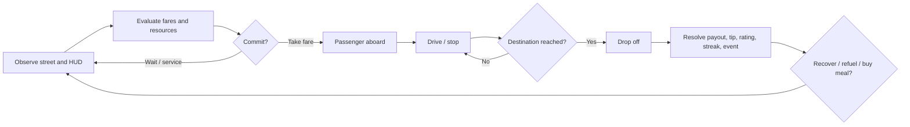
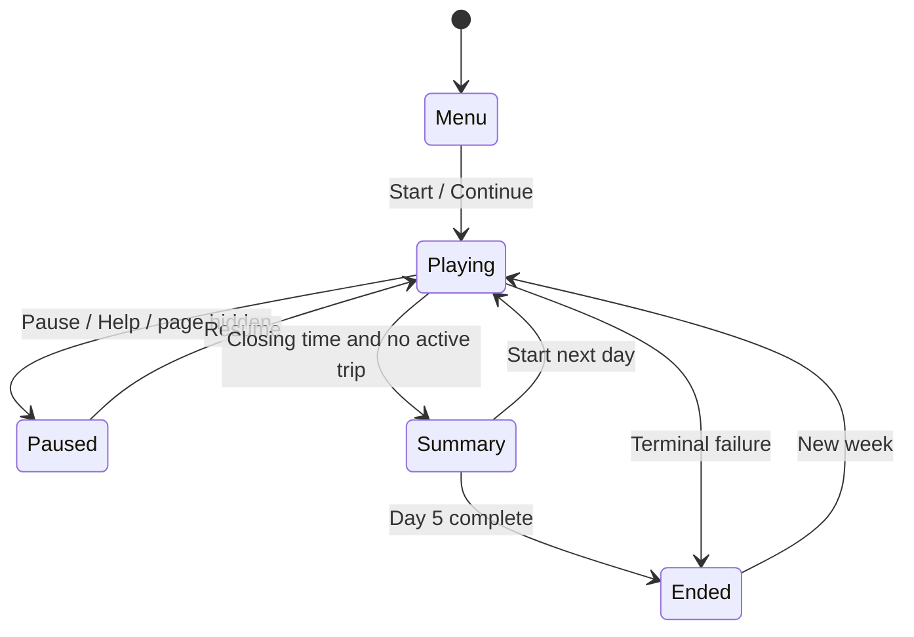

# TAXi — Street Shift
## Production Game Design Document

**Status:** Living design authority  
**Scope:** Five-day Street Shift campaign  
**Roadmap:** [#5](https://github.com/xtreemze/TAXi/issues/5)  
**Architecture:** Static, browser-native, zero production dependencies

---

## 1. Purpose and authority

This document defines the intended player experience, system relationships, measurable design requirements, balancing framework, implementation constraints, and release gates for **TAXi: Street Shift**.

When implementation details, old prototype behavior, or incidental constants conflict with this document, resolve the discrepancy deliberately through an issue or pull request. Do not silently preserve behavior merely because it already exists.

The repository, tests, explicit design decisions, and current accepted issues remain the implementation record. This GDD defines the product intent those artifacts should satisfy.

---

## 2. Product thesis

**TAXi: Street Shift is an economic survival game disguised as a tiny driving game.**

The player operates an independent taxi through a five-day working week. Every minute, kilometer, passenger, meal, liter of fuel, and service stop affects the business. The player succeeds by identifying profitable opportunities, limiting waste, protecting service quality, and recovering intelligently from mistakes.

The central fantasy is not realistic driving. It is:

> Keep a small transportation business alive through judgment, timing, and efficient movement.

The game should be understandable within minutes, complete within one short session, and replayable because the player can become materially better at reading the same systems.

---

## 3. Product goals

### G-01 — Fast comprehension
A new player should understand how to accept a fare, drive, stop, complete a trip, and read the main resources without consulting external documentation.

### G-02 — Meaningful trade-offs
Most player actions should exchange at least one scarce resource for another: time, cash, fuel, energy, inventory, rating, or opportunity.

### G-03 — Short complete campaigns
A full five-day campaign should normally fit within roughly **12–25 minutes**, including decisions and day summaries.

### G-04 — Learnable mastery
Returning players should improve through better judgment rather than faster reflexes or hidden knowledge.

### G-05 — Multiple viable strategies
At least three distinct operating styles should be viable across a representative set of seeds and conditions.

### G-06 — Browser-native identity
The game should remain a self-contained static web application unless a future product requirement clearly justifies an architectural change.

---

## 4. Non-goals

Street Shift is not currently intended to become:

- a free-steering driving simulator;
- an open-world navigation game;
- a realistic traffic simulation;
- a persistent account/meta-progression service;
- an inventory-heavy crafting game;
- a large narrative RPG;
- a multiplayer service;
- a framework-dependent web application;
- a game whose difficulty depends on opaque randomness or unreadable timers.

Future proposals may revisit these boundaries, but they must first explain what decision quality or player fantasy they improve.

---

## 5. Design pillars

### P-01 — Every action touches the economy
Driving, waiting, refueling, eating, buying supplies, taking a passenger, and recovering from emergencies all consume or transform scarce resources.

### P-02 — The street communicates opportunity
Passengers, motion, weather, destination state, and important world conditions should be visible in the play surface rather than hidden behind application-style navigation.

### P-03 — Physicality without simulation overhead
Parallax, perspective, moving road detail, wheel motion, weather, and procedural sound create the sensation of travel while controls remain strategically simple.

### P-04 — Consequences are readable before commitment
Distance, fare value, time pressure, service cost, resource level, and other material information should be visible before the player makes a consequential choice.

### P-05 — Failure emerges from accumulated decisions
The game should punish repeated inefficiency, neglect, or risk rather than surprise the player with arbitrary game-over events.

### P-06 — Recovery is possible but costly
Emergency mechanics should prevent brittle soft locks while preserving consequences.

### P-07 — Depth before breadth
New mechanics are justified only when they create a new decision or materially reshape an existing one.

### P-08 — Prefer the platform before a dependency
Use mature browser primitives when they satisfy the requirement well enough.

---

## 6. Player experience arc

### First minutes
The player learns the literal verbs:

1. inspect a fare;
2. accept a passenger;
3. drive;
4. stop;
5. drop off;
6. collect payment.

### First shift
The player discovers that:

- empty driving wastes resources;
- services cost both money and time;
- not every large fare is efficient;
- lateness has consequences;
- the closing clock changes what counts as a good fare.

### Midweek
The player begins planning across days:

- fuel thresholds;
- meal inventory;
- nightly operating cost;
- rating preservation;
- weather and rush-hour timing;
- whether to recover now or defer spending.

### Skilled play
The player reasons about:

- revenue per kilometer;
- revenue per minute;
- risk-adjusted payout;
- expected resource cost;
- service opportunity cost;
- streak preservation;
- late-shift option value;
- medium-term upgrade or maintenance choices when those systems are introduced.

---

## 7. Core loop

The loop must remain legible even as new systems are added. New systems should modify the evaluation or resolution steps rather than create unrelated parallel games.

---

## 8. Campaign structure

A standard campaign contains **five shifts**.

- Shift opens: **07:00**
- Shift closes: **19:00**
- Current campaign cash target: **L 3,000**
- Current starting cash: **L 450**
- Current starting fuel: **75%**
- Current starting energy: **90%**
- Current starting meals: **2**
- Current starting rating: **3.2 / 5**
- Current nightly operating cost: **L 110**

These are balancing constants, not immutable product rules.

### Baseline target math

Ignoring optional service purchases, the current target requires a net increase of **L 2,550** across five days, or about **L 510 net per day**. With the current **L 110** nightly cost, the player needs roughly **L 620 gross contribution per day** before additional fuel/meal purchases and other losses.

This arithmetic is useful as a balancing anchor: the campaign target should be demanding enough to require efficient decisions, but not so high that only one fare strategy can reach it.

---

## 9. Campaign state model

### State invariants

- There is never more than one active passenger trip.
- A completed trip resolves exactly once.
- Trip progress never exceeds trip distance.
- Fuel, energy, and rating remain within defined bounds.
- Services cannot be used while driving.
- Terminal states do not continue simulation ticks.
- A new day begins only after the prior day is resolved.
- Save state remains serializable and versioned.

Implementation hardening is tracked in [#6](https://github.com/xtreemze/TAXi/issues/6).

---

## 10. Fare system

Passengers are the primary economic opportunities.

Every offer exposes enough information to judge:

- destination;
- distance;
- payout;
- expected urgency/deadline;
- meaningful contextual modifiers.

### Fare archetypes

| Archetype | Strength | Risk |
| --- | --- | --- |
| Short / reliable | quick completion, low resource exposure, good near closing | low absolute payout |
| Standard | balanced baseline | rarely exceptional |
| Long / premium | high gross payout and possible efficiency | high time commitment, fuel exposure, congestion/deadline risk |

The best fare must depend on context. A system in which “always take the highest fare” or “always take the best cash/km fare” dominates is considered under-balanced.

### Functional requirements

- **FR-FARE-001:** Offers must expose destination, distance, and payout before acceptance.
- **FR-FARE-002:** Offers expire, creating opportunity cost for waiting.
- **FR-FARE-003:** Long/high-risk fares must carry an economically meaningful premium.
- **FR-FARE-004:** Offer generation must become deterministic under a supplied seed for testing.
- **FR-FARE-005:** Demand composition may vary by time, weather, and district, but material modifiers must remain understandable.

---

## 11. Time and demand

Time is the universal pressure connecting every system.

The clock advances during:

- driving;
- waiting;
- refueling;
- eating;
- buying supplies;
- traffic delay.

### Functional requirements

- **FR-TIME-001:** A stopped taxi halts trip distance but not the shift clock.
- **FR-TIME-002:** Services consume explicit simulated time.
- **FR-TIME-003:** Rush periods are predictable enough to plan around.
- **FR-TIME-004:** The final hour should materially change rational fare selection.
- **FR-TIME-005:** Future demand curves should create distinct opening, midday, rush, and closing behavior.

Demand/world expansion is tracked in [#8](https://github.com/xtreemze/TAXi/issues/8).

---

## 12. Driving and movement

Driving remains intentionally binary: **Driving** or **Stopped**.

While driving:

- trip progress advances;
- scenery moves;
- fuel drains;
- energy drains;
- empty movement is economically costly.

While stopped:

- trip progress pauses;
- the clock continues;
- passengers and services can be considered.

### Functional requirements

- **FR-DRIVE-001:** The player can toggle movement through pointer/touch and keyboard.
- **FR-DRIVE-002:** Driving without a passenger must consume resources without generating direct revenue.
- **FR-DRIVE-003:** The visual world must communicate movement without requiring a game engine.
- **FR-DRIVE-004:** Movement must remain understandable under reduced-motion preferences.

---

## 13. Fuel

Fuel exists primarily to punish inefficient movement and poor planning.

### Intended decisions

- Is another fare worth delaying refuel?
- Is empty driving justified?
- Is a longer fare still attractive at the current tank level?

### Functional requirements

- **FR-FUEL-001:** Driving consumes fuel; stopping does not consume driving fuel.
- **FR-FUEL-002:** Refueling has visible cash and time costs.
- **FR-FUEL-003:** Running critically low creates pressure before hard failure.
- **FR-FUEL-004:** Roadside recovery prevents brittle soft locks but is materially worse than planned refueling.
- **FR-FUEL-005:** Future efficiency upgrades must not eliminate fuel as a meaningful constraint.

---

## 14. Energy and meals

Energy models the driver’s sustainable ability to work.

Meals connect immediate recovery to inventory and future planning.

### Functional requirements

- **FR-ENERGY-001:** Active driving drains energy faster than waiting.
- **FR-ENERGY-002:** Heat or future environmental states may alter energy economics.
- **FR-ENERGY-003:** Eating restores energy at a time/inventory cost.
- **FR-MEAL-001:** Meals can be purchased with cash and time.
- **FR-MEAL-002:** Meal inventory participates in overnight recovery.
- **FR-MEAL-003:** Reaching zero energy is a terminal failure unless a future explicit recovery rule replaces it.

---

## 15. Rating, deadlines, tips, and streaks

Rating represents business viability and passenger trust rather than a cosmetic score.

### Lateness

Lateness should degrade results progressively rather than flip instantly from success to failure.

Possible consequences include:

- reduced payout;
- rating loss;
- lost streak;
- reduced tip chance.

### Tips

Tips are upside, not required base income. They reward good service without making campaign success depend on luck.

### Streak

A streak rewards consistency and gives the player something to protect beyond cash.

### Functional requirements

- **FR-RATE-001:** Severe or repeated poor service can terminate a run through rating collapse.
- **FR-RATE-002:** Good service has positive long-term value.
- **FR-LATE-001:** Deadline risk is visible before acceptance.
- **FR-LATE-002:** Lateness penalties scale rather than relying only on a binary cutoff.
- **FR-TIP-001:** Tip probability/reward may vary but must not be necessary for baseline solvency.
- **FR-STREAK-001:** Consistent good trips should produce a modest compounding benefit.

---

## 16. Weather, traffic, and districts

Environmental systems are economic modifiers first and visual modifiers second.

### Current weather archetypes

| State | Economic character |
| --- | --- |
| Clear | baseline |
| Rain | slower traffic / greater operating pressure / better fares |
| Heat | greater energy pressure / modest fare compensation |

### Rules for future world modifiers

- A modifier must change a meaningful decision.
- Its important effect must be readable.
- It must not create an always-accept or always-reject fare category.
- District identity should reuse the street/dispatch model rather than requiring free navigation.

World-depth work is tracked in [#8](https://github.com/xtreemze/TAXi/issues/8).

---

## 17. Street events

Street events add texture after meaningful player actions.

They may affect:

- cash;
- rating;
- energy;
- time;
- future opportunity.

### Requirements

- **FR-EVENT-001:** Events resolve clearly and quickly.
- **FR-EVENT-002:** Events must not dominate player skill.
- **FR-EVENT-003:** Important negative events should be recoverable when possible.
- **FR-EVENT-004:** Event randomness must use the deterministic RNG boundary introduced by #6.

---

## 18. Daily operating costs

Revenue and profit must remain visibly distinct concepts.

Nightly costs represent maintenance, permits, insurance, parking, financing, or other overhead without requiring detailed bookkeeping.

### Functional requirements

- **FR-COST-001:** Operating cost is resolved explicitly at shift end.
- **FR-COST-002:** The day summary distinguishes fares/revenue from resulting cash position.
- **FR-COST-003:** A profitable-looking day may still be strategically weak if service purchases and overhead consume the margin.

---

## 19. Victory, completion, and failure

### Campaign success
Finish all five shifts at or above the campaign cash target while remaining operational.

### Campaign completion below target
Completing the week below target is a completed but unsuccessful economic result, not necessarily an abrupt game-over.

### Terminal failure
A run may end early because of conditions such as:

- unrecoverable fuel failure;
- energy exhaustion;
- rating below the operating threshold;
- cash/credit position below the allowed floor.

### Requirements

- **FR-END-001:** Every terminal state must state what happened and why.
- **FR-END-002:** Completed runs display final cash, score, and relevant performance context.
- **FR-END-003:** Failure causes should be traceable to earlier decisions rather than hidden state.

---

## 20. Scoring

Cash determines business survival. Score supports mastery and replayability.

Score may reward:

- completed fares;
- payout;
- punctuality;
- rating;
- streak;
- final cash;
- future efficiency metrics.

Score must not replace or obscure the economic objective.

---

## 21. Strategy model

The balanced game should support distinct viable approaches.

| Strategy | Typical behavior | Natural risk |
| --- | --- | --- |
| Conservative operator | short/reliable fares, early service, rating protection | leaves premium revenue unused |
| High-throughput driver | rapid short/medium fare cycling, little idle time | service timing and fatigue pressure |
| Premium hunter | waits for large fares, uses favorable demand windows | opportunity cost, congestion, deadline exposure |
| Efficiency optimizer | continuously evaluates cash/km, cash/minute, current resources | complexity and risk of over-optimization |

The goal is not equal performance in every seed. The goal is that different strategies become correct under different conditions.

---

## 22. Balancing framework

Balancing must be evidence-driven once deterministic simulation exists.

### Primary metrics

| Metric | Purpose |
| --- | --- |
| Revenue / km | movement efficiency |
| Revenue / simulated minute | time efficiency |
| Fuel / km | operating pressure |
| Energy / active minute | sustainable shift length |
| Service opportunity cost | true cost of recovery |
| Daily overhead coverage | minimum viable productivity |
| Lateness probability | risk exposure |
| Tip/streak contribution | upside from service quality |
| Failure cause distribution | whether one system dominates difficulty |

### Provisional outcome targets

These are design targets to validate and revise under [#7](https://github.com/xtreemze/TAXi/issues/7), not claims about current measured performance.

- A first-time player should commonly survive multiple days even if they miss the final cash target.
- A player who understands the systems should be able to reach the target consistently without requiring a single scripted policy.
- At least three heuristic policies should show credible win distributions over many seeds.
- No one fare tier should dominate all weather/time windows.
- Emergency roadside recovery should materially reduce expected final cash compared with planned refueling.
- Tips should improve good runs but should not decide whether a competent baseline policy is solvent.
- Failure causes should be distributed across multiple forms of poor management rather than concentrated overwhelmingly in one resource.

### Balance workflow

1. Make simulation deterministic (#6).
2. Define baseline policies.
3. Execute many seeded campaigns.
4. Record percentile outcomes and failure causes.
5. Tune constants.
6. Re-run policy comparison.
7. Play manually to ensure numerical balance remains understandable and enjoyable.
8. Record accepted target bands in this document.

---

## 23. Progression and maintenance

Progression should create specialization rather than simple power creep.

Candidate upgrade axes:

- fuel efficiency;
- tank capacity;
- reliability;
- comfort/tip potential;
- heat mitigation;
- maintenance efficiency.

### Requirements

- **FR-UPG-001:** Every upgrade has a meaningful cash, time, or opportunity cost.
- **FR-UPG-002:** Prefer sidegrades and specialization to universal percentage improvements.
- **FR-UPG-003:** A no-upgrade campaign remains viable.
- **FR-UPG-004:** No upgrade eliminates fuel, energy, rating, or time as a meaningful constraint.
- **FR-MAINT-001:** Maintenance reinforces the revenue-versus-profit distinction.

Progression is tracked in [#9](https://github.com/xtreemze/TAXi/issues/9).

---

## 24. Interface and interaction design

The interface should behave like a **cockpit**, not a dashboard application.

### Persistent HUD

Communicates:

- day;
- time;
- cash;
- fuel;
- energy;
- meals;
- rating.

### Dispatch region

Communicates:

- available fares or active trip;
- destination;
- payout;
- trip progress;
- remaining distance;
- deadline/buffer;
- services and their costs.

### Street

Communicates:

- passengers;
- movement;
- destination arrival;
- weather;
- time-of-day atmosphere;
- future district identity.

### Interaction requirements

- **UI-001:** Every critical action is available by pointer/touch.
- **UI-002:** Core play is complete by keyboard.
- **UI-003:** Current state is not communicated by color alone.
- **UI-004:** Consequential values are visible before commitment.
- **UI-005:** Contextual teaching is preferred over long tutorial modal sequences.
- **UI-006:** Mobile layout preserves the same decision information as desktop.

Onboarding/accessibility work is tracked in [#10](https://github.com/xtreemze/TAXi/issues/10).

---

## 25. Input contract

Current keyboard mappings:

| Action | Key |
| --- | --- |
| Drive / stop | `Space` |
| Pick best fare / drop off | `Enter` |
| Refuel | `R` |
| Eat | `E` |
| Buy meal | `B` |
| Mute / unmute | `M` |
| Pause / resume | `P` |
| Help | `H` |

Shortcuts are accelerators, not prerequisites.

---

## 26. Accessibility requirements

Accessibility is architectural, not post-release polish.

- **A11Y-001:** Use semantic/native controls where appropriate.
- **A11Y-002:** Preserve native `<dialog>` semantics for modal surfaces.
- **A11Y-003:** Preserve native `<progress>` semantics for completion/progress indicators.
- **A11Y-004:** Maintain visible keyboard focus.
- **A11Y-005:** Provide text equivalents for color, animation, and sound cues.
- **A11Y-006:** Respect `prefers-reduced-motion` without hiding state changes.
- **A11Y-007:** Prevent pointer-only game actions.
- **A11Y-008:** Touch targets remain comfortably operable on narrow mobile layouts.
- **A11Y-009:** Avoid excessive live-region announcements; announce only state changes that materially aid nonvisual play.
- **A11Y-010:** Zoom/reflow must not make critical controls or values inaccessible.

---

## 27. Visual direction

TAXi combines:

- retro browser-game directness;
- contemporary editorial typography;
- transportation/signage cues;
- stylized CSS 3D geometry;
- bold status/economic colors;
- strong silhouettes and readable depth.

The goal is representational clarity, not realism.

### Visual requirements

- The taxi must remain instantly recognizable.
- Passenger opportunities must remain legible against the street.
- Weather changes should alter atmosphere without hiding critical information.
- Parallax/depth should communicate motion but never be required to understand game state.
- CSS-generated/world-native art remains preferred where it supports portability and identity.

---

## 28. Audio direction

Procedural Web Audio provides lightweight feedback and mechanical character.

Current/desired cue classes:

- pickup;
- payment;
- arrival;
- service;
- error/warning;
- engine hum;
- day transition.

### Audio requirements

- **AUD-001:** The game remains fully playable muted.
- **AUD-002:** Audio never carries exclusive information.
- **AUD-003:** Audio begins only after user interaction as required by browser policy.
- **AUD-004:** Future music should remain lightweight/reactive and should not require a runtime asset framework unless clearly justified.

---

## 29. Technical design constraints

Production should remain:

- static;
- directly hostable from repository source;
- zero production npm dependencies;
- framework-free unless requirements materially change;
- functional without CDN/runtime network services;
- built from semantic HTML, modern CSS, and vanilla JavaScript;
- based on standard DOM events, Web Audio, Web Storage, visibility APIs, `<dialog>`, `<progress>`, and other native capabilities where appropriate.

Development/CI tooling may use Node, Playwright, GitHub Actions, and other isolated tooling when they materially improve verification without entering the shipped runtime.

### Technical requirements

- **TECH-001:** Production must not require a build step to run.
- **TECH-002:** Production must not load third-party runtime scripts/styles from external origins.
- **TECH-003:** Simulation state remains serializable and versioned.
- **TECH-004:** Randomness becomes seedable for deterministic testing (#6).
- **TECH-005:** Rendering should derive from state rather than becoming an independent source of truth.
- **TECH-006:** Native browser primitives are preferred over bespoke replacements where behavior and styling remain sufficient.

---

## 30. Persistence

Local persistence currently covers:

- active shift state;
- sound preference;
- high score.

### Requirements

- **SAVE-001:** Reloading can resume a viable active shift.
- **SAVE-002:** Invalid/incompatible saves fail safely.
- **SAVE-003:** Save schema changes are versioned.
- **SAVE-004:** Hiding the document pauses active simulation so a background tab cannot silently consume the shift.

---

## 31. Testing strategy

### Static contract

CI verifies:

- required production files exist;
- no external runtime scripts/styles are loaded;
- no production dependency is introduced accidentally;
- required native dialog/progress architecture remains intact;
- JavaScript syntax remains valid.

### Browser smoke test

A real browser must be able to:

1. load the game;
2. verify the start dialog;
3. start a shift;
4. receive an offer;
5. accept a passenger;
6. start driving;
7. observe active trip state;
8. observe progress advancing;
9. complete without uncaught browser errors.

### Deterministic simulation tests

[#6](https://github.com/xtreemze/TAXi/issues/6) adds non-visual scenario tests for:

- normal fare completion;
- lateness;
- fuel emergency;
- exhaustion;
- rating failure;
- end-of-day accounting;
- save/restore;
- campaign success;
- campaign completion below target;
- terminal-state invariants.

### Balance simulation

[#7](https://github.com/xtreemze/TAXi/issues/7) adds multi-seed policy evaluation and balance reporting.

---

## 32. Release gates

A production candidate is releasable only when:

- the static/native contract passes;
- deterministic simulation tests pass;
- real-browser gameplay smoke tests pass;
- representative mobile/desktop visual captures succeed;
- no uncaught browser errors occur;
- save compatibility is verified;
- keyboard, pointer/touch, and reduced-motion flows pass;
- production remains self-contained and dependency-free unless an explicit architecture decision says otherwise;
- accepted performance/accessibility budgets are met.

Release certification is tracked in [#11](https://github.com/xtreemze/TAXi/issues/11).

---

## 33. Implementation roadmap

### Phase 1 — Simulation foundation
**Issue:** [#6](https://github.com/xtreemze/TAXi/issues/6)

- seedable RNG;
- isolate state transitions from rendering where useful;
- deterministic tick/action execution;
- explicit invariants and scenario tests.

**Exit condition:** identical seed + action sequence produces identical campaign state/result.

### Phase 2 — Evidence-based economy
**Issue:** [#7](https://github.com/xtreemze/TAXi/issues/7)

- baseline heuristic policies;
- multi-seed simulation;
- percentile outcome reporting;
- target/failure/resource tuning;
- documented accepted balance bands.

**Exit condition:** at least three distinct viable policies with no universal dominant policy.

### Phase 3 — World depth
**Issue:** [#8](https://github.com/xtreemze/TAXi/issues/8)

- district identities;
- explicit demand curves;
- deeper weather/traffic interactions;
- time/district risk premiums.

**Exit condition:** time, district, and weather combinations materially change rational fare selection without obscuring why.

### Phase 4 — Strategic progression
**Issue:** [#9](https://github.com/xtreemze/TAXi/issues/9)

- maintenance;
- sidegrade-oriented taxi improvements;
- campaign-scale specialization.

**Exit condition:** progression creates distinct strategies while a no-upgrade campaign remains viable.

### Continuous track — Comprehension and accessibility
**Issue:** [#10](https://github.com/xtreemze/TAXi/issues/10)

Audit after every major system addition.

### Final/continuous gate — Release quality
**Issue:** [#11](https://github.com/xtreemze/TAXi/issues/11)

Maintain automated release criteria throughout development and use them as the final production gate.

---

## 34. Change governance

A proposed mechanic should answer all of the following before implementation:

1. What player decision does this create or improve?
2. Which scarce resources does it interact with?
3. What information must the player see before committing?
4. How can it fail without feeling arbitrary?
5. How can it be simulated or tested deterministically?
6. Does it preserve the short-campaign product identity?
7. Can the browser platform implement it adequately without a new production dependency?
8. Which requirement or roadmap issue does it satisfy?

If the proposal cannot answer those questions, it is probably additional surface area rather than useful depth.

---

## 35. Product identity statement

TAXi should remain small enough to understand and rich enough to master.

Its distinguishing qualities are:

- an economic game presented as a compact driving game;
- a street that doubles as the main interface;
- meaningful resource pressure without spreadsheet complexity;
- browser-native visuals and procedural audio;
- short complete campaigns;
- replayability through improved judgment rather than grind;
- extremely low production/runtime overhead.

The governing long-term principle is:

> **Do not make TAXi larger merely by adding more systems. Make each shift more interesting by making the existing systems matter to one another.**
